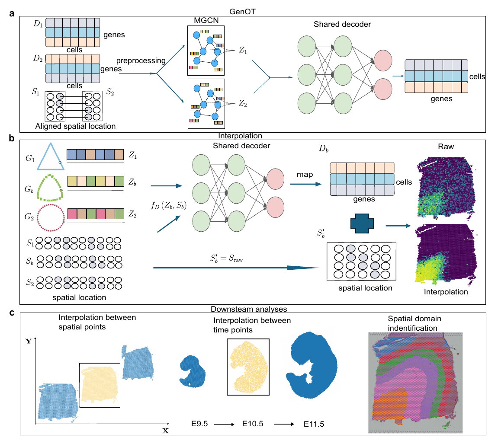

Welcome to GenOT's documentation!
===================================

GenOT: Optimal Transport-Driven Generation of Cross-Platform Spatial Transcriptomic Data and Spatiotemporal Continuous Modeling
=====================================================================================================================================================

.. toctree::
   :maxdepth: 3
   
   Installation
   Tutorial 1_DLPFC
   Tutorial 2_MOSTA
   Tutorial 3_Mouse_Hippocampus
   Tutorial 4_Mouse_Olfactory(Stero-seq & Slide-seqV2)
   Tutorial 5_Mouse_Brain_Merge_Anterior_Posterior(Section1,2)
   Tutorial 6_DLPFC_interpolation
   Tutorial 7_MOSTA_integration
   Tutorial 8_Diff_Tech_MOSTA_integration
   data
   credits

Overview
========
Spatial transcriptomics (ST) technologies have revolutionized the analysis of spatial gene expression patterns within tissues. However, existing computational methods still face challenges in integrating spatial information and generating cross-heterogeneous sample data. To address this, we developed GenOT - a spatial data generation framework based on graph self-supervised contrastive learning and optimal transport theory. The framework employs a multimodal feature learning architecture to dynamically identify important genes  and hierarchically aggregate spatial neighborhood information, achieving high-precision spatial domain clustering and biologically interpretable feature extraction. The core innovation of GenOT lies in introducing an optimal transport barycenter-based interpolation algorithm, which mathematically models cross-sample spatial distribution differences to reconstruct spatiotemporal continuous gene expression dynamics. Experiments on multiple datasets including human dorsolateral prefrontal cortex (10x visium), mouse embryonic development (Stereo-seq), and olfactory bulb/hippocampal tissues (Slide-seqV2) demonstrate that GenOT significantly outperforms existing methods in spatial domain identification, cross-technology platform integration, and developmental trajectory reconstruction. This provides an innovative tool for tissue structure analysis at single-cell resolution and developmental process modeling.

Citation
========
 soon

